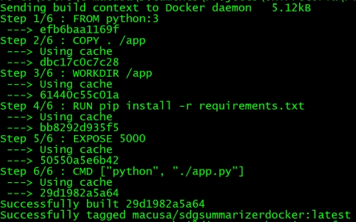
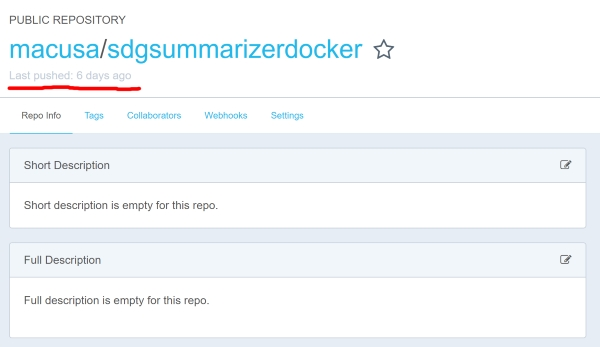
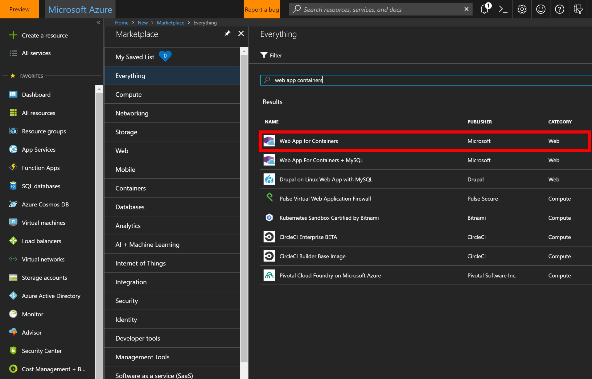
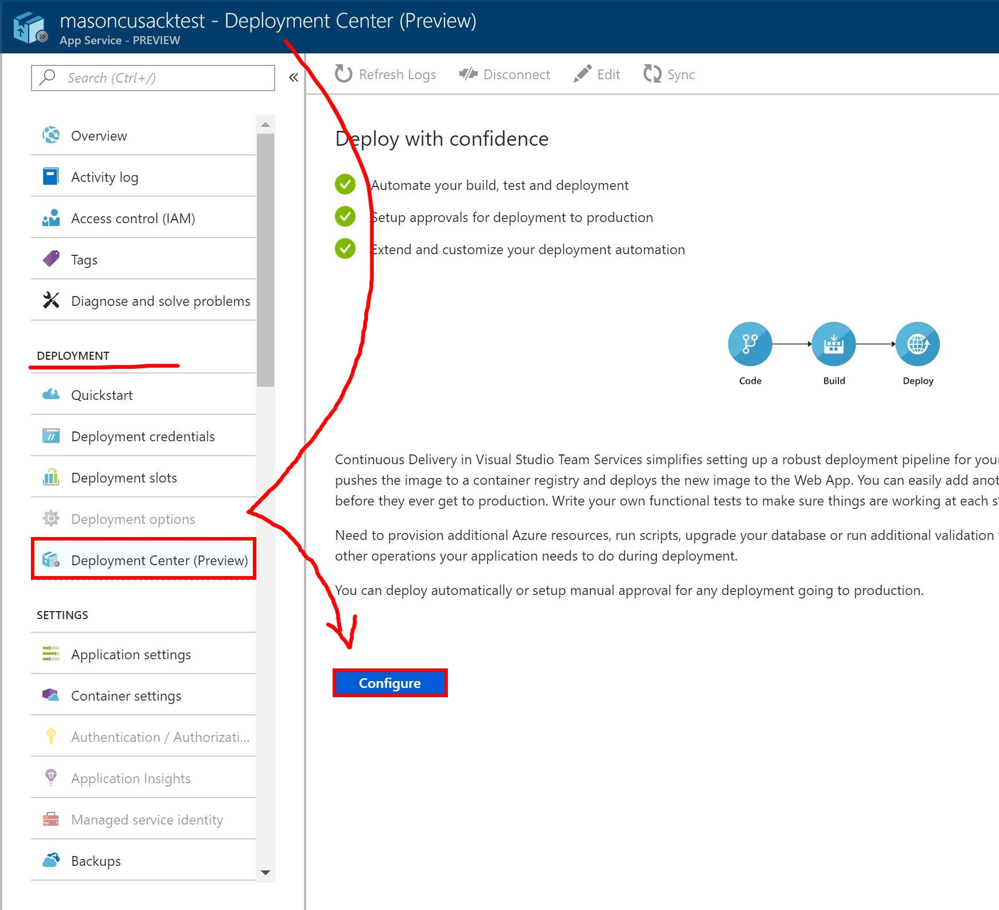
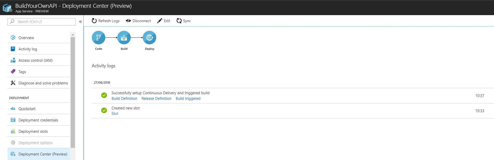
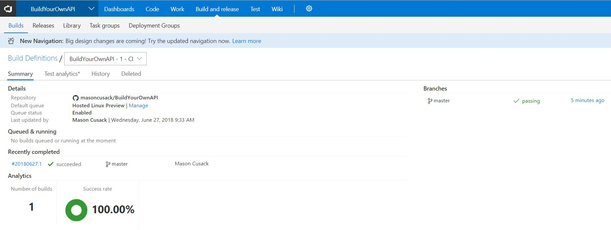

# Build-Your-Own API: Write and Deploy Dockerized Flask Apps on Azure

### Contents


- <a href="https://github.com/masoncusack/buildyourownapi#introduction">Introduction</a>


- <a href="https://github.com/masoncusack/buildyourownapi#prerequisites">Prerequisites</a>


- <a href="https://github.com/masoncusack/buildyourownapi#step-1-cloning-the-project-code-and-local-setup">Cloning the project and local setup</a>


- <a href="https://github.com/masoncusack/buildyourownapi#step-2-the-flask-api---whats-in-the-code-and-how-to-run-it">The Flask API - What's in the code? (And how to run it)</a>


- <a href="https://github.com/masoncusack/buildyourownapi#step-3-docker-build">Docker, Build!</a>


- <a href="https://github.com/masoncusack/buildyourownapi#step-4-pushing-your-built-image-to-docker-hub">Pushing your built image to Docker Hub</a>


- <a href="https://github.com/masoncusack/buildyourownapi#step-5-azure-web-apps-for-containers">Azure Web Apps for Containers</a>


- <a href="https://github.com/masoncusack/buildyourownapi#step-6-setting-up-continuous-deployment-in-azure">Setting Up Continuous Deployment in Azure</a>


- <a href="https://github.com/masoncusack/buildyourownapi#step-7-sync-and-deploy">Sync and Deploy!</a>


- <a href="https://github.com/masoncusack/buildyourownapi#test-your-api">Test your API</a>


### Introduction

Hello! You're looking at a guide and open source sample for Dockerized Flask apps on Azure. Specifically, we'll be using a combination of Python, the <a href="https://azure.microsoft.com/en-gb/">Azure</a> Portal, and <a href="https://www.docker.com/">Docker</a>, to build and deploy a pre-packaged text summarization model via a <a href="http://flask.pocoo.org/">Flask API</a>, running on a Docker container, in the cloud.

In doing so, we'll set up a pipeline for continuous iteration and deployment of your service - whether it continues to use a package like Gensim to do the heavy lifting, or consists of a pickled custom TensorFlow, CNTK, or Torch model you wish to expose as a prediction endpoint. That's assuming you're doing machine learning - you can also use this sample to bootstrap any alternative Python code you might want to deploy as an API!

It is in fact a simple process, but a poorly documented one in which your steps must be precise, and errors in the event of a misstep are often unhelpful. I'm here to help with that!

Notes: 

- If you are comfortable with the use and purpose of Flask and Docker and are just looking for the exact steps to deployment on Azure, <a href="https://github.com/masoncusack/buildyourownapi#step-4-pushing-your-built-image-to-docker-hub">skip to Step 4</a>. 

- If you notice mistakes, details left out, are unsuccessful in using this guide, or wish to ask me a question, please go via the usual GitHub routes to request changes, or <a href="https://twitter.com/masoncusack">tweet me</a>.

### Prerequisites

A few things you'll need to get set up to run and deploy this project:

 - Python 3 - download at https://python.org (remembering to check the little box 'add Python 3.x to PATH')
 - <a href="https://www.docker.com/docker-windows">Docker for Windows</a> - OG Docker will work of course. If you are running Linux, you should be able to follow along. For Windows users, make sure Docker commands are working when executed in Powershell, as that is what we will use for building and pushing images for deployment.
 - An Azure subscription, <a href="https://azure.microsoft.com/en-gb/">get one (or start a free trial) here</a>.
 - A code editor (I recommend <a href="https://code.visualstudio.com/">VS Code</a> nowadays).
 - A local git installation. <a href="https://git-scm.com/">Get git here</a>.
 - <a href="https://visualstudio.microsoft.com/team-services/">VSTS</a> and <a href="https://hub.docker.com/">Docker Hub</a> accounts (GitHub also useable for source code, but VSTS will be used to track our builds on deployment)
 
### Step 1: Cloning the project code and local setup

Whether you wish to use my text summarization example or not, it may help to use this code to bootstrap your Flask app. 

Open a terminal (Powershell for example), navigate to a working directory, and enter `git clone https://github.com/masoncusack/buildyourownapi`.

Among many things, this will get you the source code in `/src/app`, which I at least know builds successfully with Docker.

There is also a `requirements.txt` file which contains everything you need to run the code. If wishing to run the Python code locally (before building with docker, which will do this for you), use the command `pip install -r requirements.txt` from the `/app` directory in your favourite terminal. 

> Incidentally, the `DOCKERFILE` inside the `/src/app` directory will do this automatically on local builds and first deployment, meaning the deployment of new functionalities can take a short time to kick in. We'll come back to that later.

Anyway, after some installs, you should now be set up to run the code locally.

### Step 2: The Flask API - What's in the code? (And how to run it).

Upon opening `/app/app.py`, you should notice a few abnormalities when compared to your normal Python script.

As a Python package like any other, Flask is quite easy to set up, and we do it here in a specific way:

```
   from flask import Flask, jsonify, request 
   from flask_cors import CORS 
```
The need for `import Flask` is obvious, but note that `jsonify` will be used to format the result we deliver to the caller of our API.

`from flask_cors import CORS` is then used to enable `CORS(app)` on line 8. This is simply useful for testing, as it will allow calls to the API from all potential origins, including local development builds of frontend apps. Handy, but be aware that it could be a security risk in practice. You can <a href="https://developer.mozilla.org/en-US/docs/Web/HTTP/CORS">learn more about it here</a>.

`app = Flask(__name__)` is then simply the initialization of our app, before it is wrapped to allow cross-origin access.

#### Routes

You will notice from this point several "routes", which head functions:

```
@app.route('/')
def hello_world():
...

@app.route('/summary', methods=['GET'])
def get_summary():
...

@app.route('/keywords', methods=['GET'])
def get_keywords():
...

```

As you may have guessed, these define both the specific endpoints of our API, and the functions they run when called, thus we nest within these separate functions our various functionalities, in this case the return of a summarization of the given text, and keywords.

#### Handling caller input

Within each of these endpoint functions, we capture the input provided by the caller in the query string, anticipating it to be labelled 'text':

```input_string = request.args.get('text')```

A valid query string is thus constructed as follows:

```domain-on-which-api-is-running/endpoint?text=content-for-which-we-desire-summarization-or-keywords```

Regardless of which endpoint is called in this case, the API takes the value of the input variable 'text' and uses it to compute a summary or keywords. Failure to provide an input labelled 'text' in the query string will result in a Bad Request error or similar.

#### Running and testing

Note the following line in the main function:

`app.run(host="0.0.0.0")`

This sets the app up to run by default on the localhost address (127.0.0.1) of the system/image it's started on.

You can run the flask app locally using `python app.py` from within `src/app`, and go to `http://127.0.0.1:5000` to see it in action (5000 is the default port). You may need to install flask locally using `pip install Flask` before this will work.

Note what is returned at this root endpoint, and what happens when you change the endpoint and provide an input.

At the root endpoint `/`, you should get the output:

`Hello, World! Try the endpoints /summary?text=yourtext or /keywords?text=yourtext`

### Step 3: Docker, build!

Once your Python code's written, you should be ready to build.

Go to Powershell (or your favourite terminal).

After logging in to your docker hub account using `docker login --username=yourhubusername`, and entering your password when prompted...

From the root directory (above the `app` directory), run the command 

`docker build app -t docker-hub-username/docker-hub-project-name:optionaltag`

Docker will now attempt to compile the contents of the app directory using the `DOCKERFILE` within it. You should then see lots of positive sentiments like "successfully built".



A couple of notes on this:

- My system is building from cache because I've already run this command before. Unless you tell it to, docker won't run python installations it's instructed to in the dockerfile on the local image if it doesn't detect changes to requirements.txt. Bear in mind therefore that build times can vary. On first build, you'll have to sit through a bunch of pip installs. That's your sign for success!


- In this case my Docker Hub account username is macusa, and my project title sdgsummarizerdocker. The tag `latest` is added optionally, to keep track of multiple versions with the same name. Just append it onto your project name with a colon separating, if you want it.

You can also tag an image after the fact using `docker tag your-image docker-hub-username/project-title:desired-tag`

You can test your container locally from this point using `docker run REPOSITORY`, where `REPOSITORY` is the value in the column with heading `REPOSITORY` when you run `docker images`. If you've been following along, it should be `docker-hub-username/project-title`.

Note that the Docker container may take longer to kick in than the Flask app when running locally.

At any time, you can use the command `docker ps` to view currently running containers and their status.

If it runs at this stage, then it'll deploy.

You can run `docker images` at any time to see your recently built images. You should see your latest build at the top with its associated tag (if assigned). Note that it has been assigned an `IMAGE ID`.

This is what we're going to push to Docker Hub, and then load into an Azure App Service.

### Step 4: Pushing your built image to Docker Hub

Check that your latest build is ready with the `docker images` command.

If you haven't already, sign into Docker using `docker login --username=yourhubusername`, followed by your password when prompted.

Now run `docker push docker-hub-username/project-title`

This works much like a `git push`, so you should see progress bars, followed (perhaps in a minute or so), by a success message.

It's now a good idea to go to your Docker Hub repo, and make sure that the "last pushed" time value is correct.



Immediately after a successful push, this should say "a few seconds ago".

### Step 5: Azure Web Apps for Containers

Excellent, now that your image is pushed to Docker Hub, you're almost ready to deploy to an Azure Web app for Containers instance.

Just a couple of things to double check:

- Your latest source code (from root, including your 'app' directory), is checked into either a GitHub or VSTS repo. We'll use this to continually deploy from by linking your Azure account to it.


- You have a VSTS account to use with Azure (this'll give us handy build reports and logs as we attempt to deploy on the cloud - if your build is working locally but failing on deployment, all the juicy info will be in these logs). 

Open the <a href="https://portal.azure.com">Azure portal</a>, and click "create a resource".

Search "web app containers" and it should be the first result: "Web App for Containers" by publisher "Microsoft" in category "Web". 



Click this resource and then click "create".

You'll be greeted by the usual screen we get upon setting up any resource in Azure. This can be the most frustrating part if you don't know what precisely to enter. The required inputs are given below.

>  *App Name*: All one word, this defines both the name and web domain (url) of your app, so make sure it's unique.

>  *Subscription*: The subscription you wish to use to pay for this app service and the resources it relies on.

>  *Resource group*: The resource group you wish to contain the resources used by this app service (storage etc.)

>  *App Service plan/Location*: Select the app service plan you want this app to use. 

>  *Configure container*: 

> - In this case we're deploying a single container.

> - *Image Source*: should be Docker Hub

> - *Repository Access*: set to that of your Docker Hub repo (public by default)

> - *Image and optional tag*: the `REPOSITORY` upon running `docker images`. If you've been following along, it will follow the pattern `docker-hub-username/project-title`.

Once these are filled, check the box "pin to dashboard" and click "create".

### Step 6: Setting up continuous deployment in Azure

Once it you get a notification saying "deployment successful", you know your app service is ready to use. This is a service running our Docker image in Azure, to which we can deploy our source code.

Go to your Azure portal dashboard and locate the app service you just created. 

Click on it, and navigate in the service's side menu to "Deployment Center (Preview)". Once there, click "Configure" (pictured below).



This'll open up another side menu with fields to fill. Required inputs are below.

> *Source code*:

- *Code repository*: Select whether to deploy from GitHub or VSTS.
    
- *Repository*: Select from here which repo to use to pull your latest source code from. 
    
- *Branch*: Which branch should Azure use for deployment? You may want to keep a branch separate just for this, or use Master.
    
> *Container image source*: your image source and image name will be set for you as a result of the previous setup, but here you need to provide
    
- *Username*: Your Docker Hub username
    
- *Password*: Your Docker Hub password
    
- *Startup command*: Forget this, as in our case the command first run upon building the image is provided in the DOCKERFILE.
    
- *Dockerfile path*: This is important. It's relative to the root directory of our source repo, and is how the app will find our dockerfile in order to build the image and run our API. In our case therefore it's `src/app/DOCKERFILE`  
    
> *Team Services*: in this section you'll set up the connection to the VSTS account which you'll use to build and deploy the Docker image. It'll also give you access to detailed logs and reports for the build process as mentioned earlier.  
    
- *Account name*: Select the VSTS account you wish to use for this from the dropdown.
    
- *Project name*: Select the Project associated with that account that you'd like to build from (this can be an empty project). 
    
- Note you can also create a new account if you don't have one yet, in which case this part of the setup will be slightly different.
    
> *Deploy*:  
    
- *Deploy to staging*: Select `Yes` if you want to deploy a preview version of the API before a production version, so you can demo it and test it before going live. In this case '-deployment-slot-name' (your next input) will be appended to the end of the deployed endpoint (url), before 'azurewebsites.net'. For example https://buildyourownapi-staging.azurewebsites.net is a staging slot of the web app buildyourownapi, for which the deployment slot was named 'staging'.

- *Deployment slot*: On first deployment you'll have to create a new slot. Call it whatever you want. Accept the default `staging` if you're okay with that, but if wanting to keep it more private, you could create and use a random GUID you only give to your team for testing, or use a passphrase of some kind.
    
Note that whatever you do, this endpoint will be public once deployed. If wanting to test your API offline, just <a href="https://github.com/masoncusack/buildyourownapi#running-and-testing">run the flask app locally and test against localhost</a> as before.

Note also that you will have to click "ok" at the bottom of the sections described the above after completing each, to save your changes.

### Step 7: Sync and deploy!

Finally, click "ok" and you'll be taken back to the deployment center to watch as your API deploys. If you don't get a notification 'deploying' or 'deploying in progress', or see any other signs of life, click "sync" from within the deployment center to kick it into action.

In the Deployment Center, after a few minutes of "configuring deployment", you should see:



Which means your app has deployed successfully on the cloud. It does not, however, tell us the most important thing - whether your app has built successfully once deployed. This we can check by selecting "build definition" under "Successfully setup Continuous Delivery and triggered build" in the deployment center.

This will take us to the VSTS project used to build the docker image, in which you should see:



If instead it says "failed", click the latest entry under "Recently Completed" to view the logs and see what went wrong.

In future, after committing new source code or Docker images, you can ensure redeployment of your updated API just by clicking "sync" from the Deployment Center, though it should theoretically kick in immediately after you've pushed. Just come back here to double check if needed.


### Test your API

All you need now is a web browser.

In the side menu of your app service, click `Deployment slots`. You'll see a table with name, status, and app service plan columns. Click on a slot with status 'running' and you'll be taken to an overview page for that instance. From here you can click `browse` to call the root endpoint of that API.

Note:

- It may take a little time for the API to kick in, even after a successful deployment. Don't be afraid to give it 10 minutes before deciding that something's wrong, even after an apparently successful build, and particularly on the first deployment. "Internal server errors" are commonly a result of errors in your app.py source code.


- You can take the url of this endpoint (now in the address bar of your browser) and call it again at any point in the future (not only from the Azure portal).


- The way the sample is set up, on calling this root endpoint, instructions for other endpoints to try (including for summarization and keywords) will be returned, with the message "Hello, World!". Try using these endpoints, by pasting your own text into the query string as variable `text`. Note that for both summary and keywords to be returned, you will need a substantial body of text. I'd suggest using a news article or similar. Too little text and with this code you'll cause an internal server error (a good extension task for both of us would be to handle this error in the eventuality that the received text body is too small for gensim to process).

### Conclusion

There you have it! You've built a custom API using Python, Flask, Docker, and hosted it in the Azure cloud. Please let me know what you build with this new capability.

And of course if you had any problems or questions along the way, please submit an issue, <a href="mailto:t-macusa@microsoft.com?Subject=BuildYourOwnAPI">email me</a>, or <a href="https://twitter.com/masoncusack">tweet me</a> at @masoncusack.

### Common problems

#### Docker for Windows not installing: 

Docker asks you to manually install containers, changing the necessary settings and restarting doesn't help.

> In Hyper-V, [try turning on MobyVM manually](https://github.com/docker/for-win/issues/1631).

Please feel free to submit an issue and any associated fixes, and I'll post them here. Or, see the [Issues](https://github.com/masoncusack/BuildYourOwnAPI/issues) for yourself.